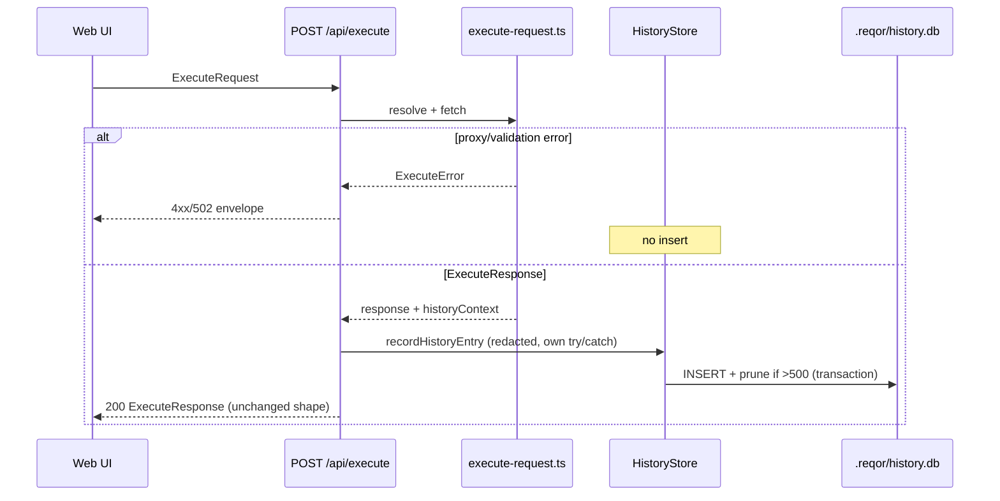

# Story 4.1: History Persistence in SQLite

Status: done

<!-- Note: Validation is optional. Run validate-create-story for quality check before dev-story. -->

## Definition of Done

- [x] **`better-sqlite3` ^12.1.0** (12.x floor with Node 24 prebuilds) added to pnpm catalog + `@reqor/server` dependencies; builds on Node 24 (AD-13, AD-15)
- [x] **`HistoryStore`** creates/opens `.reqor/history.db` on first insert; schema migrated idempotently; DB path `{repositoryRoot}/.reqor/history.db` (AD-12, AD-13)
- [x] **Successful `POST /api/execute`** (proxy completes with `ExecuteResponse` — any target HTTP status including 4xx/5xx) inserts a History Entry **after** response is ready (FR16, AD-13)
- [x] **No history insert** on `UNRESOLVED_VARIABLE`, `PROXY_FAILED`, `TOO_MANY_REDIRECTS`, `NOT_FOUND`, `INVALID_REQUEST`, or client abort before response (Story 1.7 / 2.5 error paths)
- [x] Entry records **ISO-8601 UTC** `sentAt`, `environmentName` (nullable), `collectionId`, `fingerprint`, **pre-redirect** resolved **redacted** `method` + `url`, `statusCode`, `durationMs`, `sizeBytes` (= live `ExecuteResponse.sizeBytes`, not recomputed after redaction), response metadata + **full redacted** response body on disk (NFR6, AD-21)
- [x] **500-entry cap** per Repository Root — oldest rows pruned on insert after cap exceeded (AD-13)
- [x] **`GET /api/history`** returns newest-first list DTOs with response bodies truncated at **1MB UTF-8 bytes** when `bodyTruncated: true` (AD-24)
- [x] **`GET /api/history/:id`** returns detail DTO with **full** stored body (still secret-redacted; not re-truncated) (AD-24)
- [x] **History insert failure** does not fail execute — recorder has its **own** try/catch so errors never reach the execute route catch-all (would become false `502 PROXY_FAILED`); log warn (no secret values); execute response still returned (NFR7)
- [x] **History survives server restart** — verified by closing/reopening `HistoryStore` or new `buildApp` instance against same repo root
- [x] Shared TypeBox DTOs in `@reqor/shared-types`; web **unchanged** this story (sidebar placeholder stays — Story 4.2)
- [x] `pnpm turbo build test typecheck` passes workspace-wide

### Anti-patterns (do not ship)

- Do not implement History sidebar, replay into editor, or web `GET /api/history` consumers — **Story 4.2**
- Do not record history on transport/proxy failures — only completed proxy round-trips with `ExecuteResponse`
- Do not record history on `UNRESOLVED_VARIABLE` (send blocked) or pre-proxy validation errors
- Do not store plaintext secrets in SQLite — use existing `redactSecrets()` with `resolution.secrets` from `resolveRequest()` (NFR6, Story 2.5)
- Do not return plaintext secrets in history API responses
- Do not create `history.db` at server startup before first successful send — lazy create on first insert (implementation-readiness / Epic 1 Story 1.4 note)
- Do not add a second persistence model (JSON files) — SQLite only (AD-13)
- Do not fail `POST /api/execute` when history insert/prune fails — best-effort side effect; never let history errors escape into `routes/execute.ts` catch-all
- Do not import `@reqor/http-parser` from web or add TanStack Query history hooks — 4.2
- Do not truncate stored DB body at 1MB — truncate only in **list/summary** DTO projection; detail endpoint returns full stored body (AD-24)
- Do not capture post-redirect `currentUrl` / `nextMethod` for history — use **pre-redirect** `resolution.resolved.url` / `.method` (FR16 sent request)
- Do not recompute `sizeBytes` from the redacted stored body — copy `response.sizeBytes` (wire/panel value)
- Do not use `String.slice` for 1MB truncation — UTF-8 byte-accurate truncate only
- Do not reinvent `.gitignore` / `.reqor/` bootstrap — CLI `bootstrap-reqor-dir.ts` already handles that; HistoryStore only `mkdirSync` parent dir for DB open
- Do not use collections-style `*` wildcard for history ids — use named `:id` with TypeBox integer/digit params schema
- Do not regress execute, preview, save, env resolution, or Send gating from Epics 1–3

## Story

As a **developer debugging API interactions**,
I want sent requests recorded locally with metadata,
So that I have a durable log of what I tested even after closing Reqor.

## Acceptance Criteria

1. **Given** a request is successfully sent via `POST /api/execute`  
   **When** the proxy completes with an `ExecuteResponse` (including target 4xx/5xx)  
   **Then** a History Entry is inserted into `.reqor/history.db` via `better-sqlite3` (FR16, AD-13)  
   **And** entry records timestamp (ISO-8601 UTC), environment name, method, URL, status code, duration, and fingerprint  
   **And** method/URL are the **pre-redirect** resolved values from `resolution.resolved` (what the user sent), not the final redirect hop  
   **And** `collectionId` and `fingerprint` are persisted for Story 4.2 replay rematch (AD-21)

2. **And** response body is stored in full in SQLite with secrets redacted via `redactSecrets(text, resolution.secrets)` (NFR6)  
   **And** resolved URL stored in history is redacted the same way  
   **And** response header values are redacted before JSON serialization  
   **And** `sizeBytes` persisted equals `ExecuteResponse.sizeBytes` (pre-redaction UTF-8 length)

3. **And** history is capped at **500** entries per Repository Root — oldest pruned on insert when count exceeds cap (AD-13)

4. **And** `GET /api/history` returns entries newest-first as summary DTOs  
   **And** response bodies over **1MB** (`1_048_576` bytes UTF-8) are truncated in list DTOs with `bodyTruncated: true` and `body` containing the truncated prefix (AD-24)  
   **And** truncation is UTF-8 byte-accurate (not `String.slice` / UTF-16 code units)

5. **And** `GET /api/history/:id` returns the full stored response body (redacted, not display-truncated) (AD-24)  
   **And** unknown numeric id → `404 NOT_FOUND`; non-numeric `:id` → Fastify/TypeBox validation failure (`400`)

6. **And** history survives server restart — entries readable after process restart against the same repository root

7. **When** execute fails before a response (`PROXY_FAILED`, `UNRESOLVED_VARIABLE`, etc.)  
   **Then** no history row is inserted

8. **When** history insert/prune throws  
   **Then** `POST /api/execute` still returns the successful `ExecuteResponse` (NFR7)

## Tasks / Subtasks

- [x] Task 1: Dependency + constants (AC: #1)
  - [x] 1.1 Add `better-sqlite3: ^12.1.0` to `pnpm-workspace.yaml` catalog; add to `packages/server/package.json` dependencies (floor ≥12.1.0 for Node 24 / N-API 137 prebuilds — AD-15)
  - [x] 1.2 Add `allowBuilds` entry for `better-sqlite3` if pnpm blocks native build (mirror `esbuild` pattern in `pnpm-workspace.yaml`)
  - [x] 1.3 Add shared constants (server or shared-types): `HISTORY_MAX_ENTRIES = 500`, `HISTORY_BODY_DISPLAY_LIMIT = 1_048_576`

- [x] Task 2: Shared types (AC: #4, #5) — AD-10
  - [x] 2.1 Add to `packages/shared-types/src/index.ts`:
    - `HistoryEntrySummaryDto` — `{ id, sentAt, environmentName, collectionId, fingerprint, method, url, statusCode, durationMs, sizeBytes, body: string, bodyTruncated: boolean }`
    - `HistoryEntryDetailDto` — extends summary fields + `{ statusText, responseHeaders, bodyTruncated: false }` (detail always full body)
    - `HistoryListResponse` — `{ entries: HistoryEntrySummaryDto[], total: number }` where `total === entries.length` (≤500; no server pagination in MVP)
  - [x] 2.2 Extend `packages/shared-types/src/index.test.ts` with `Value.Check()` samples

- [x] Task 3: HistoryStore (AC: #1–#3, #6) — AD-12, AD-13
  - [x] 3.1 Create `packages/server/src/history-store.ts`:
    - Constructor takes `repositoryRoot` (or joined db path — prefer aligning with `ConfigStore` by accepting full db path from `app.ts` via `path.join(repositoryRoot, '.reqor', 'history.db')`)
    - Lazy init on first `insert`: `fs.mkdirSync(dirname(dbPath), { recursive: true })` then open DB + `ensureSchema()` — use **sync** mkdir (better-sqlite3 is sync; do not copy async `config-store` mkdir)
    - Do **not** reimplement `.gitignore` — CLI `packages/cli/src/bootstrap-reqor-dir.ts` already ensures `.reqor/` + gitignore; tests using `buildApp()` alone must still mkdir via HistoryStore
    - Optional on open: `PRAGMA journal_mode = WAL` (reads during insert)
    - `insert(entry: HistoryInsertInput): number` — wrap insert+prune in `db.transaction(() => { ... })()` so they stay atomic on the event loop
    - Prune when `COUNT(*) > 500` deleting oldest by `sent_at ASC, id ASC`
    - `list(): HistoryRow[]` — newest first
    - `getById(id: number): HistoryRow | null`
    - Synchronous `better-sqlite3` API; wrap DB open in try/catch for testability
  - [x] 3.2 Create `packages/server/src/history-truncate.ts`:
    - `truncateBodyForDisplay(body: string, limit = HISTORY_BODY_DISPLAY_LIMIT): { body: string, bodyTruncated: boolean }`
    - Algorithm: encode to UTF-8 bytes; if over limit, walk back continuation bytes (`10xxxxxx`) then `TextDecoder().decode(bytes.subarray(0, end))` so the result never exceeds the byte limit and never splits a codepoint
  - [x] 3.3 Create `packages/server/src/to-history-dto.ts` — map row → summary/detail DTOs with truncation helper
  - [x] 3.4 Unit tests `history-store.test.ts`:
    - Insert + list order (newest first)
    - Prune at 501st insert keeps 500 newest
    - Restart simulation: close DB, new `HistoryStore` same path reads rows
    - Schema idempotent (double `ensureSchema` safe)

- [x] Task 4: Wire execute → history (AC: #1, #2, #7, #8) — FR16
  - [x] 4.1 Extend `packages/server/src/proxy/execute-request.ts`:
    - **Capture point (authoritative):** after `resolveRequest` succeeds and **before** the redirect `while` loop, snapshot `historyMethod = resolution.resolved.method` and `historyUrl = resolution.resolved.url` (do not use mutated `currentUrl` / `nextMethod` after redirects)
    - On successful return, build `ExecuteHistoryContext` from in-scope values: `body.collectionId`, `req.fingerprint`, `deps.environmentName`, snapshotted method/url, `resolution.secrets`
    - Return `{ response: ExecuteResponseType, history: ExecuteHistoryContext }` (update return type; adjust callers)
  - [x] 4.2 Create `packages/server/src/record-history-entry.ts`:
    - `recordHistoryEntry(store, context, response)` — redact url/body/headers; map fields; `store.insert(...)`; **entire function body in try/catch** → `log.warn` without secrets; never rethrow
  - [x] 4.3 Update `packages/server/src/routes/execute.ts`:
    - Receive `HistoryStore` via route options (same pattern as other stores — pass via `register` options; do **not** add unused `app.decorate('historyStore')`)
    - After successful execute: call `recordHistoryEntry(...)` **before** returning response
    - Critical: recorder must swallow errors internally — outer `catch` at `routes/execute.ts` maps any throw to `ExecuteError` / `502 PROXY_FAILED` and would falsely fail a successful proxy if history throws (NFR7)
  - [x] 4.4 Update `packages/server/src/app.ts`:
    - `const historyStore = new HistoryStore(path.join(options.repositoryRoot, '.reqor', 'history.db'))` (or equivalent)
    - Pass to `executeRoutes`; register new `historyRoutes`
  - [x] 4.5 Extend `execute.test.ts`:
    - After successful inject, `.reqor/history.db` exists; `GET /api/history` length === 1
    - Entry has correct method/url/status/duration/fingerprint; `sizeBytes` matches response
    - Secret in resolved URL/body not present in DB or API (mirror dotenv fixture at `execute.test.ts` ~`{{$dotenv API_KEY}}`)
    - `PROXY_FAILED` / `UNRESOLVED_VARIABLE` → no row inserted
    - 404 from target still inserts history (HTTP response received)
    - Redirect follow: history URL/method remain **pre-redirect** resolved values

- [x] Task 5: History read routes (AC: #4, #5, #6)
  - [x] 5.1 Create `packages/server/src/routes/history.ts`:
    - `GET /api/history` → `HistoryListResponse` (`total === entries.length`)
    - `GET /api/history/:id` with params schema, e.g.:
      ```typescript
      app.get<{ Params: { id: string } }>(
        '/api/history/:id',
        { schema: { params: Type.Object({ id: Type.String({ pattern: '^[0-9]+$' }) }) } },
        async (request, reply) => {
          const id = Number(request.params.id)
          // ...
        },
      )
      ```
    - Unknown id → `404` `{ error: { code: 'NOT_FOUND', message: '...' } }`
  - [x] 5.2 Create `packages/server/src/history.test.ts` — list ordering, detail full body, 404 unknown id, non-numeric id → 400, >1MB list truncation vs detail full (boundary at `1_048_576 + 1` UTF-8 byte)
  - [x] 5.3 Register routes in `app.ts` before static handler

- [x] Task 6: Integration verification (AC: #6)
  - [x] 6.1 `pnpm turbo build test typecheck`
  - [x] 6.2 Manual smoke: send `demo.http` → restart server → `GET /api/history` shows entry

### Review Findings

- [x] [Review][Patch] Codepoint-safe UTF-8 list truncation that never exceeds `HISTORY_BODY_DISPLAY_LIMIT` [packages/server/src/history-truncate.ts:11]
- [x] [Review][Patch] History DB created on read paths, not only first insert [packages/server/src/history-store.ts:162]
- [x] [Review][Patch] `statusText` stored without `redactSecrets` [packages/server/src/record-history-entry.ts:31]
- [x] [Review][Patch] Unguarded `JSON.parse` on `response_headers_json` can crash list/detail [packages/server/src/history-store.ts:71]
- [x] [Review][Patch] `@types/better-sqlite3` pinned outside pnpm catalog while runtime is catalogued [packages/server/package.json:30]

## Dev Notes

### Epic context

Epic 3 (edit + save) is **done**. Epic 4 delivers **FR16** request history. **Story 4.1** is **server-only persistence + read API**. **Story 4.2** wires the History sidebar, search, replay, and truncation expand UI (UX-DR5, UX-DR9, UX-DR17).

**In scope:** SQLite store, execute hook, `GET /api/history`, `GET /api/history/:id`, secret redaction, 500 cap, 1MB display truncation.

**Out of scope:** Web sidebar population, replay into editor, keyboard history navigation (UX-DR21), virtual-scroll UI (UX-DR25), expand-to-full button (UX-DR17 — 4.2).

**Pagination note:** `solution-design.md` mentions a “paginated” history list; AD-13 / FR16 / this story override that — single list ≤500, no query pagination; 4.2 virtual-scrolls client-side. Do not reintroduce server pagination.

### History record flow (authoritative)



### What counts as “successfully sent”

| Outcome | Insert history? | URL/method recorded |
|---------|-----------------|---------------------|
| `200` + `ExecuteResponse` (any target status 1xx–5xx) | **Yes** | Pre-redirect `resolution.resolved` |
| Target HTTP 404/500 in response body path | **Yes** — proxy completed | Pre-redirect |
| Redirects followed then final response | **Yes** | Pre-redirect (not final hop) |
| `502 PROXY_FAILED` / timeout / DNS | **No** | — |
| `400 UNRESOLVED_VARIABLE` | **No** — never proxied | — |
| `404 NOT_FOUND` collection/request | **No** | — |
| `400 INVALID_REQUEST` | **No** | — |

Live `ExecuteResponse` to the web **unchanged** — still returns full target body for the response panel. Redaction applies to **persisted history** and **history API** only (same pattern as preview redaction vs raw execute body).

### Authoritative capture + field mapping

Build history context in `execute-request.ts` **after** successful resolve, **before** redirect loop. Map live response → insert:

| History field | Source |
|---------------|--------|
| `collectionId` | `body.collectionId` |
| `fingerprint` | `req.fingerprint` (disk `RequestDto`, 64-hex) |
| `environmentName` | `deps.environmentName` (`string \| null`) |
| `method` | `resolution.resolved.method` (pre-redirect snapshot) |
| `url` | `resolution.resolved.url` (pre-redirect; redact in recorder) |
| `secrets` | `resolution.secrets` (`string[]` — may widen to `readonly string[]`) |
| `statusCode` | `response.status` |
| `statusText` | `response.statusText` |
| `durationMs` | `response.timingMs` |
| `sizeBytes` | `response.sizeBytes` (do **not** recompute after redaction) |
| `responseHeaders` | `response.headers` (redact each `value` in recorder) |
| `responseBody` | `response.body` (redact in recorder) |
| `sentAt` | `new Date().toISOString()` (UTC) at insert time |

### SQLite schema (recommended)

```sql
CREATE TABLE IF NOT EXISTS history_entries (
  id INTEGER PRIMARY KEY AUTOINCREMENT,
  sent_at TEXT NOT NULL,
  environment_name TEXT,
  collection_id TEXT NOT NULL,
  fingerprint TEXT NOT NULL,
  method TEXT NOT NULL,
  url TEXT NOT NULL,
  status_code INTEGER NOT NULL,
  status_text TEXT NOT NULL,
  duration_ms REAL NOT NULL,
  size_bytes INTEGER NOT NULL,
  response_headers_json TEXT NOT NULL,
  response_body TEXT NOT NULL
);
CREATE INDEX IF NOT EXISTS idx_history_sent_at ON history_entries (sent_at DESC, id DESC);
```

One index is enough — prune’s `ORDER BY sent_at ASC, id ASC` can reverse-scan the same index; do not add a second ascending index.

Store `response_headers_json` as `JSON.stringify(redactedHeaders)`.

Prune pattern (inside same transaction as insert):

```sql
DELETE FROM history_entries WHERE id IN (
  SELECT id FROM history_entries ORDER BY sent_at ASC, id ASC LIMIT ?
);
-- ? = count - 500 after insert
```

### API contracts

**`GET /api/history`**

```typescript
{
  entries: HistoryEntrySummaryDto[]
  total: number  // === entries.length, <= 500
}
```

Newest first. Summary `body` truncated at 1MB UTF-8 byte length; set `bodyTruncated: true` when truncated.

**`GET /api/history/:id`**

Returns `HistoryEntryDetailDto` with full stored `body` (redacted, not display-truncated). `404` `{ error: { code: 'NOT_FOUND', message: '...' } }` for unknown id. Non-digit `:id` fails params schema (`400`).

**`POST /api/execute`** — response shape **unchanged** (`ExecuteResponse` only). No history id in execute response (4.2 loads list separately).

### Secret redaction (NFR6)

Reuse `packages/server/src/redact-secrets.ts`. Canonical call-site pattern: `packages/server/src/routes/preview.ts` (redact URL + each header value — not `redactObject` on arrays).

| Field | Redaction |
|-------|-----------|
| Stored `url` | `redactSecrets(resolvedUrl, secrets)` |
| Stored `response_body` | `redactSecrets(response.body, secrets)` |
| Each response header `value` | `redactSecrets(value, secrets)` |
| Server logs on history failure | Never log raw body or secrets; log error code / message only |

`secrets` comes from `resolveRequest()` → `resolution.secrets` (same list as preview/execute logging — Story 2.5).

**Test fixture** (mirror `execute.test.ts` dotenv pattern):

```http
GET https://{{host}}/get
Authorization: Bearer {{$dotenv API_KEY}}
```

```json
// http-client.env.json
{ "development": { "host": "httpbin.dev" } }
```

```env
# .env
API_KEY=super-secret-token
```

Assert history row and `GET /api/history` JSON do **not** contain `super-secret-token`.

### Execute refactor notes

`executeRequest` currently returns `ExecuteResponseType` directly. Extend to return history context **without** exposing secrets to the HTTP response:

```typescript
export interface ExecuteHistoryContext {
  collectionId: string
  fingerprint: string
  environmentName: string | null
  method: string
  url: string       // pre-redirect resolved, plaintext — redact in recordHistoryEntry
  secrets: readonly string[]
}

export interface ExecuteSuccessResult {
  response: ExecuteResponseType
  history: ExecuteHistoryContext
}

export interface HistoryInsertInput {
  sentAt: string
  environmentName: string | null
  collectionId: string
  fingerprint: string
  method: string
  url: string              // already redacted
  statusCode: number
  statusText: string
  durationMs: number
  sizeBytes: number        // from ExecuteResponse.sizeBytes
  responseHeaders: Array<{ name: string; value: string }>  // values already redacted
  responseBody: string     // already redacted
}
```

Update unit callers: `const result = await executeRequest(...)` → `result.response`. Prefer HTTP `app.inject()` for integration coverage.

`fingerprint` from disk `RequestDto` (`req.fingerprint`), not recomputed from resolved URL — AD-21 rematch uses template identity.

### Architecture compliance (MUST follow)

| AD / FR / NFR | Requirement for 4.1 |
|---------------|---------------------|
| AD-12 | DB under `.reqor/history.db` only; no secrets vault |
| AD-13 | better-sqlite3 ^12.1.0 (12.x); 500 cap |
| AD-21 | Persist `collectionId` + `fingerprint` |
| AD-24 | Full body in DB; list DTO truncates at 1MB UTF-8 bytes; detail returns full |
| AD-10 | TypeBox DTOs in shared-types |
| AD-15 | Node 24.x — pin sqlite ≥12.1.0 for prebuilds; verify native module loads in CI |
| FR16 | Record on send (pre-redirect method/URL) |
| NFR6 | No plaintext secrets in history |
| NFR7 | History failure must not crash execute or alter execute status |

### Scope boundaries

**In scope:** HistoryStore, schema, execute hook, history routes, redaction, truncation helper, tests.

**Out of scope:**
- History sidebar UI / replay / search (4.2)
- Execute response shape changes
- History on save (only on send)
- Pagination query params (500 cap fits single list response for MVP; 4.2 virtual-scrolls client-side)
- `@types/better-sqlite3` if package ships types (it does)
- Replacing or duplicating `bootstrap-reqor-dir.ts` gitignore logic

### Current code state (touch points)

| File | Current state | This story |
|------|---------------|------------|
| `packages/server/package.json` | No sqlite | **UPDATE** — add better-sqlite3 ^12.1.0 |
| `pnpm-workspace.yaml` | No sqlite in catalog; `allowBuilds.esbuild` | **UPDATE** — catalog + allowBuilds |
| `packages/server/src/proxy/execute-request.ts` | Returns `ExecuteResponse` only; mutates `currentUrl` in redirect loop | **UPDATE** — snapshot pre-redirect + return history context |
| `packages/server/src/routes/execute.ts` | Proxy only; catch-all → 502 | **UPDATE** — record history with isolated try/catch |
| `packages/server/src/app.ts` | No history; stores passed via register options | **UPDATE** — HistoryStore + routes (no decorate) |
| `packages/server/src/routes/preview.ts` | Canonical redaction call sites | **READ** — mirror pattern |
| `packages/server/src/redact-secrets.ts` | Used by preview/execute logs | **READ** — reuse |
| `packages/server/src/resolve-request.ts` | Returns `secrets: string[]` | **READ** |
| `packages/cli/src/bootstrap-reqor-dir.ts` | Ensures `.reqor/` + gitignore on CLI serve | **READ** — do not reinvent |
| `packages/shared-types/src/index.ts` | No history types | **UPDATE** |
| `packages/web/src/components/SidebarShell.tsx` | History tab placeholder | **NO CHANGE** (4.2) |

### Previous story intelligence (Epic 3 — latest: 3.3)

- Server patterns: TypeBox DTOs, `app.inject()` tests with temp repo, atomic `.reqor/` writes (`config-store.ts` mkdir + tmp pattern — **async**; HistoryStore must use sync mkdir)
- Execute already resolves env + draft overrides via `mergeDraftOverrides` + `resolveRequest` — history must capture **post-resolution, pre-redirect** method/url
- Do not slow or block save/execute critical paths — history is side effect
- Review lesson from 3.3: `CollectionStore` needed a queue for async concurrency; HistoryStore is fully synchronous — keep insert+prune inside one `db.transaction()` with no `await` between them

### Previous story intelligence (2.5 — send/resolution)

- **`resolveRequest()` is the single resolution path** — history method/url from `resolution.resolved` (AD-8), snapshotted before redirect mutation
- **`redactSecrets` on URL and each header value** — do not use `redactObject` on header arrays (array items skipped); mirror `preview.ts`
- History was explicitly deferred: “Do not wire history persistence for sends — Epic 4”
- `environmentName` from `resolveEnvironmentName(body.environment, configStore, environmentStore)`

### Git intelligence

- Latest: `3f65db5` raw editor highlight fix; `68f2f40` / `2d9c34b` Story 3.3 save; Epic 3 complete
- Patterns: Fastify route modules, Vitest temp repos, TypeBox schemas, `redact-secrets.test.ts` fixtures

### Testing standards

- `history-store.test.ts` — insert, list order, prune, persistence across reopen, transaction prune
- `history.test.ts` — HTTP list/detail, UTF-8 truncation boundary at 1MB+1 byte, 404 detail, 400 non-numeric id
- `execute.test.ts` — history side effect on success; no row on failure; secret redaction; pre-redirect URL after redirects; history throw does not change execute status
- Gate: `pnpm turbo build test typecheck`

### Latest technical information

- **better-sqlite3 ^12.1.0** — architecture spine 12.x; 12.1.0+ ships Node 24 (N-API 137) prebuilds; synchronous API for insert-on-send
- **Node 24 LTS** — `allowBuilds` / `pnpm approve-builds` if CI blocks native compile
- No web dependency changes this story

### Project context reference

- [Source: `_bmad-output/planning-artifacts/epics.md` — Epic 4, Story 4.1, FR16, AD-13, AD-24, NFR6]
- [Source: `_bmad-output/planning-artifacts/architecture/architecture-reqor-2026-07-08/ARCHITECTURE-SPINE.md` — AD-12, AD-13, AD-21, AD-24]
- [Source: `_bmad-output/planning-artifacts/architecture/architecture-reqor-2026-07-08/solution-design.md` — §4.2 execute sequence, §5 API, §7 `.reqor/` (pagination phrasing overridden by AD-13)]
- [Source: `_bmad-output/specs/spec-reqor/SPEC.md` — CAP-8, secrets in history]
- [Source: `_bmad-output/specs/spec-reqor/glossary.md` — History Entry, fingerprint]
- [Source: `_bmad-output/implementation-artifacts/1-7-http-proxy-execution-and-response-panel.md` — execute success vs error paths]
- [Source: `_bmad-output/implementation-artifacts/2-5-send-time-variable-resolution-and-pre-send-preview.md` — resolveRequest, redactSecrets]
- [Source: `packages/server/src/proxy/execute-request.ts`]
- [Source: `packages/server/src/routes/execute.ts`]
- [Source: `packages/server/src/routes/preview.ts`]
- [Source: `packages/server/src/redact-secrets.ts`]
- [Source: `packages/cli/src/bootstrap-reqor-dir.ts`]
- [Source: `packages/server/src/config-store.ts` — `.reqor/` mkdir pattern]

## Dev Agent Record

### Agent Model Used

Composer

### Debug Log References

- Windows WAL cleanup: added `historyStore.close()` on Fastify `onClose` to prevent EBUSY during test temp-dir cleanup
- `@types/better-sqlite3` added as devDependency (runtime package does not ship TypeScript declarations in 12.x)

### Completion Notes List

- Implemented SQLite history persistence at `.reqor/history.db` with lazy init on first successful send
- `executeRequest` now returns `{ response, history }` with pre-redirect method/URL snapshot before redirect loop
- `recordHistoryEntry` redacts secrets and swallows insert failures (NFR7) without affecting execute response
- Added `GET /api/history` (newest-first, 1MB UTF-8 list truncation) and `GET /api/history/:id` (full redacted body)
- 500-entry cap with atomic insert+prune transaction; persistence verified across server restart
- All workspace tests pass: `pnpm turbo build test typecheck` (382 tests)

### File List

- pnpm-workspace.yaml
- pnpm-lock.yaml
- packages/server/package.json
- packages/server/src/constants.ts
- packages/server/src/history-store.ts
- packages/server/src/history-truncate.ts
- packages/server/src/to-history-dto.ts
- packages/server/src/record-history-entry.ts
- packages/server/src/routes/history.ts
- packages/server/src/proxy/execute-request.ts
- packages/server/src/routes/execute.ts
- packages/server/src/app.ts
- packages/server/src/history-store.test.ts
- packages/server/src/history-truncate.test.ts
- packages/server/src/history.test.ts
- packages/server/src/execute.test.ts
- packages/shared-types/src/index.ts
- packages/shared-types/src/index.test.ts
- _bmad-output/implementation-artifacts/sprint-status.yaml

## Change Log

- 2026-07-22: Code review patches — codepoint-safe 1MB truncate, lazy DB on insert only, redact statusText, guard headers JSON parse, catalog `@types/better-sqlite3`
- 2026-07-22: Story 4.1 implemented — SQLite history store, execute hook, history read API, tests
- 2026-07-21: Ultimate context engine analysis completed — comprehensive developer guide created
- 2026-07-21: Story context validated — pre-redirect capture, sizeBytes semantics, UTF-8 truncation, NFR7 isolated catch, better-sqlite3 ^12.1.0, field mapping, HistoryInsertInput, bootstrap/mkdirSync, :id params schema, insert+prune transaction
