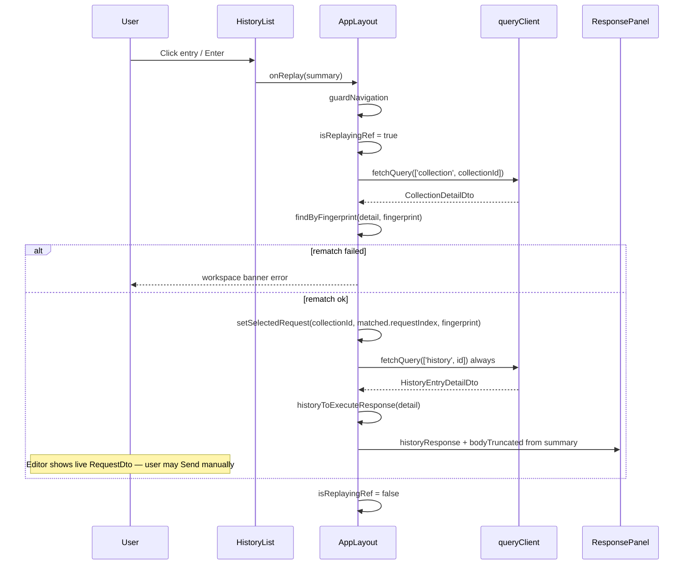

# Story 4.2: History Sidebar and Replay

Status: ready-for-dev

<!-- Note: Validation is optional. Run validate-create-story for quality check before dev-story. -->

## Definition of Done

- [ ] **`useHistory`** fetches `GET /api/history` via TanStack Query; **`useHistoryDetail(id)`** fetches `GET /api/history/:id` on demand (AD-10)
- [ ] **History tab** lists entries newest-first with method badge, truncated URL, timestamp, status, duration, environment name (UX-DR9, UX-DR13)
- [ ] **Status colors** — reuse `statusTone()` from `formatResponseBody.ts` → `text-success` for 2xx, `text-error` for ≥400 (UX-DR9)
- [ ] **Contextual search** filters History tab only by method, URL, status code string (UX-DR6); Collections search unchanged
- [ ] **Click / Enter replay** loads request workspace from **current collection file** via `collectionId` + `fingerprint` rematch (AD-21); **does not auto-send** (FR16)
- [ ] **Always fetch history detail on replay** — `ResponsePanel` is populated only from `HistoryEntryDetailDto` via `historyToExecuteResponse` (summary lacks `statusText` / `responseHeaders`)
- [ ] **Truncation UX** — when summary had `bodyTruncated: true`, show marker **"Response body truncated (>1MB). Expand to load full body."** with expand that re-fetches detail and clears the flag (UX-DR17, AD-24; fixed `>1MB` copy matches the 1MB display limit)
- [ ] **`↑`/`↓` + Enter** navigate and replay when History list focused (UX-DR21)
- [ ] **Scroll container** handles up to 500 entries with native `overflow-y-auto` — no infinite scroll (UX-DR25). **Accepted override:** epics/UX-DR25 allow paginate or virtual-scroll; MVP uses native scroll for ≤500 rows and adds virtualization only if profiling proves need
- [ ] **History tab independent** of collections load failure — user can browse history even when `GET /api/collections` errors
- [ ] **Empty states** — list empty: **"No sent requests yet."**; filtered empty: **"No matching history"** (mirror Collections `"No matching collections"`)
- [ ] **After successful Send**, history list refreshes (invalidate `['history']`) so new entry appears without manual refresh
- [ ] **Unsaved-changes guard** applies to history replay same as collection selection (`guardNavigation`)
- [ ] **No server changes** unless blocking bug — APIs and DTOs shipped in Story 4.1
- [ ] `pnpm turbo build test typecheck` passes workspace-wide

### Anti-patterns (do not ship)

- Do not add server pagination, new history endpoints, or change history DTO shapes — consume 4.1 API as-is
- Do not auto-send on history replay — user must click Send / Ctrl+Enter
- Do not switch active environment to `entry.environmentName` on replay — show env as read-only label on history row only
- Do not reconstruct request from history `method`/`url` fields — replay loads **live** `RequestDto` from collection detail (history URL is pre-redirect snapshot; file may have changed)
- Do not hydrate `ResponsePanel` from `HistoryEntrySummaryDto` — summary has no `statusText` / `responseHeaders`; always map from detail
- Do not set `selectedRequest` with a placeholder `requestIndex` before rematch — AppLayout’s index-preferring rematch effect will overwrite the history fingerprint
- Do not clear `historyResponse` in the `selectionIdentity` effect without an `isReplayingRef` (or equivalent) guard — the effect runs after commit and will blank a successful replay
- Do not import `@reqor/http-parser` in web or parse `.http` client-side (AD-3)
- Do not eager-fetch all collection details for history — fetch detail only for replay target `collectionId`
- Do not block History tab behind collections skeleton/error — decouple tab bodies in `SidebarShell`
- Do not use infinite scroll in history list (UX-DR25)
- Do not show plaintext secrets — history API already redacted (NFR6); do not add client-side secret handling
- Do not regress Collections tab search, keyboard nav, execute, save, env resolution, or editor flows from Epics 1–3

## Story

As a **developer reviewing past API calls**,
I want to browse and replay history entries from the sidebar,
So that I can quickly re-inspect or re-send previous requests.

## Acceptance Criteria

1. **Given** history entries exist  
   **When** I click the History tab (UX-DR5)  
   **Then** sidebar lists entries newest first with method badge, truncated URL, timestamp, status code, duration, and environment name (UX-DR9, UX-DR13)  
   **And** status uses success green for 2xx and error red for 4xx/5xx  
   **And** contextual search filters by method, URL, and status within History tab only (UX-DR6)

2. **When** I click a history entry (or press Enter while it is focused)  
   **Then** request workspace populates with the **current** request from the collection file — does not auto-send (FR16)  
   **And** replay rematches by `collectionId` + `fingerprint` after collection reload (AD-21)  
   **And** response panel shows the **stored** response from that history entry’s **detail** DTO (status, statusText, headers, body)

3. **When** a history response body exceeds the 1MB display limit (`bodyTruncated: true` on the list summary)  
   **Then** truncation marker reads **"Response body truncated (>1MB). Expand to load full body."** with expand action (UX-DR17)  
   **And** expand fetches `GET /api/history/:id` if full body not yet loaded, then re-renders without truncation marker

4. **And** `↑`/`↓` + Enter navigate and replay when History sidebar list is focused (UX-DR21)

5. **And** history list scrolls within the sidebar at the 500-entry cap — no infinite scroll (UX-DR25); native scroll is the accepted MVP approach (virtual-scroll only if profiling requires it)

6. **When** no history entries exist  
   **Then** History tab shows muted empty copy **"No sent requests yet."**

7. **When** history entries exist but search matches none  
   **Then** History tab shows muted empty copy **"No matching history"**

8. **When** replay cannot rematch the request (`collectionId` missing from repo or `fingerprint` not found in collection detail)  
   **Then** show clear inline error in the workspace banner/placeholder area (above the editors, not only inside ResponsePanel) — e.g. **"Could not find request in collection for this history entry."** — without crashing  
   **And** do not clear unrelated collection selection silently without feedback

## Tasks / Subtasks

- [ ] Task 1: History data hooks (AC: #1, #3)
  - [ ] 1.1 Create `packages/web/src/hooks/useHistory.ts` — `useQuery` with `queryKey: ['history']`, `GET /api/history`, typed `HistoryListResponseType`, `signal` on fetch; set `retry: false` on **test** `QueryClient` (mirror `useCollections.test.tsx`)
  - [ ] 1.2 Create `packages/web/src/hooks/useHistoryDetail.ts` — `useQuery` with `queryKey: ['history', id]`, `enabled: id != null`, `GET /api/history/${id}`, typed `HistoryEntryDetailDtoType`
  - [ ] 1.3 Hook tests mirroring `useCollections.test.tsx` — success, error, abort signal

- [ ] Task 2: Filter + display utilities (AC: #1)
  - [ ] 2.1 Create `packages/web/src/utils/filterHistory.ts` — trim query; empty → all entries; match case-insensitive on `method`, `url`, and `String(statusCode)` (same spirit as `filterCollections.ts`)
  - [ ] 2.2 Create `packages/web/src/utils/formatHistoryTimestamp.ts` — format ISO `sentAt` for row display (locale-aware short datetime; use `Date` + `toLocaleString` or `Intl.DateTimeFormat`; handle invalid ISO gracefully)
  - [ ] 2.3 Create `packages/web/src/utils/historyToExecuteResponse.ts` — map **`HistoryEntryDetailDtoType` only** → `ExecuteResponseType`:
    ```typescript
    { status: statusCode, statusText, headers: responseHeaders, body, timingMs: durationMs, sizeBytes }
    ```
    Summary cannot drive this mapping (`statusText` / `responseHeaders` absent).
  - [ ] 2.4 Extract `packages/web/src/utils/rematchRequest.ts` — shared fingerprint rematch used by AppLayout `activeRequest` and history replay (avoid algorithm drift):
    ```typescript
    // Prefer index when fingerprint still matches; else find by fingerprint
    findByFingerprint(detail, fingerprint): RequestDto | null
    ```
  - [ ] 2.5 Unit tests for `filterHistory.ts`, `historyToExecuteResponse.ts`, and `rematchRequest.ts`

- [ ] Task 3: History list UI (AC: #1, #4, #5, #6, #7)
  - [ ] 3.1 Create `packages/web/src/components/HistoryList.tsx`:
    - Props: `entries`, `filteredEntries`, `selectedHistoryId`, `onReplay(entry)`, `scrollContainerRef`, `isLoading`, `isError`
    - Flat list inside scroll container; each row: `MethodBadge`, truncated URL (`truncate` + `title`), formatted timestamp, status via `statusTone(statusCode)` → `text-success` / `text-error` / neutral, duration ms, environment name (or muted "—" when null)
    - Row selected state when `selectedHistoryId === entry.id` (subtle bg e.g. `bg-surface-muted`)
    - Keyboard: roving tabindex pattern from `CollectionTree` — `ArrowUp`/`ArrowDown` cycle visible rows, `Enter` calls `onReplay`
    - `role="listbox"` or `role="list"` with row buttons; `aria-label="History"`
  - [ ] 3.2 `HistoryList.test.tsx` — render rows, filter integration, keyboard nav, empty state delegated to parent

- [ ] Task 4: Wire SidebarShell History tab (AC: #1, #5, #6, #7)
  - [ ] 4.1 **Decouple tab bodies from collections gate** in `SidebarShell.tsx`:
    - Always render `SidebarTabs` once shell past initial load OR render tabs even during collections error
    - Collections tab: existing tree + refresh (may show collections error inline)
    - History tab: `useHistory()` + search + `HistoryList` — **not** hidden when collections fail
    - Keep independent `historySearch` + `historyScrollRef` scroll preservation (already wired)
    - Preserve UX-DR5 scroll restore when nesting list scroll vs shell scroll — if `HistoryList` owns `overflow-y-auto`, keep shell ref behavior coherent
  - [ ] 4.2 Replace placeholder (`lines 169–179`) with populated list / loading / error / empty states:
    - `entries.length === 0` → **"No sent requests yet."**
    - `entries.length > 0 && filteredEntries.length === 0` → **"No matching history"**
  - [ ] 4.3 Pass new replay callback prop from `AppLayout` → `SidebarShell` → `HistoryList`
  - [ ] 4.4 Update `SidebarShell.test.tsx` — history tab with mocked fetch, search filter (including filtered-empty copy), tab preserved on switch, history visible when collections error

- [ ] Task 5: Replay orchestration in AppLayout (AC: #2, #8)
  - [ ] 5.1 Add state + refs:
    - `selectedHistoryId: number | null`
    - `historyResponse: ExecuteResponseType | null` — displayed when replaying from history
    - `historyBodyTruncated: boolean` — drives expand UI (from **summary** `bodyTruncated` before expand)
    - `historyReplayError: string | null`
    - `isReplayingRef = useRef(false)` — guards `selectionIdentity` clear effect
  - [ ] 5.2 **Authoritative `handleReplayHistory(entry)` algorithm** (single path — no summary→panel branch):
    ```
    1. guardNavigation(async () => { ... })
    2. isReplayingRef.current = true
    3. Clear historyReplayError; set selectedHistoryId = entry.id
    4. queryClient.fetchQuery(['collection', entry.collectionId])
       → if fail / not found → set historyReplayError, isReplayingRef=false, return
    5. matched = findByFingerprint(detail, entry.fingerprint)
       → if null → set historyReplayError in workspace banner/placeholder
          (keep prior selection; do not silently clear), isReplayingRef=false, return
    6. setSelectedRequest({
         collectionId: entry.collectionId,
         requestIndex: matched.requestIndex,  // REQUIRED — never placeholder 0
         fingerprint: matched.fingerprint,
       })
    7. detailDto = await queryClient.fetchQuery(['history', entry.id])
       // ALWAYS — ResponsePanel needs statusText + responseHeaders
    8. set historyResponse = historyToExecuteResponse(detailDto)
       set historyBodyTruncated = entry.bodyTruncated  // from summary flag
    9. Do NOT call executeMutation
    10. After paint / in finally: isReplayingRef.current = false
        (or clear on next non-replay selectionIdentity change only)
    ```
  - [ ] 5.3 Display precedence in workspace:
    - While `executeMutation.isPending` → sending state (unchanged)
    - Else if fresh `executeResult` from live send for current `selectionIdentity` → show execute result
    - Else if `historyResponse` from replay → show history response (+ truncation props)
    - Else if `historyReplayError` → show inline error in workspace banner/placeholder (above editors)
    - Else if `executeError` → error message
    - Else → "Response will appear here"
  - [ ] 5.4 `selectionIdentity` effect (lines 181–184): when identity changes, clear `executeResult` / `executeError` as today; **also** clear `selectedHistoryId` / `historyResponse` / `historyBodyTruncated` / `historyReplayError` **only when `!isReplayingRef.current`**. Never rely on “same tick” ordering — the effect runs after commit.
  - [ ] 5.5 On execute success → `queryClient.invalidateQueries({ queryKey: ['history'] })` and clear history replay display in favor of live result
  - [ ] 5.6 AppLayout needs `useQueryClient()` for `fetchQuery` / `invalidateQueries`

- [ ] Task 6: ResponsePanel truncation expand (AC: #3)
  - [ ] 6.1 Extend `ResponsePanel` props (minimal):
    - `bodyTruncated?: boolean`
    - `onExpandBody?: () => void`
    - `isExpandingBody?: boolean`
  - [ ] 6.2 When `bodyTruncated && onExpandBody`, render marker above body tab content: **"Response body truncated (>1MB). Expand to load full body."** + button/link "Expand"
  - [ ] 6.3 `onExpandBody` in AppLayout: `queryClient.fetchQuery(['history', selectedHistoryId])`, remap to `ExecuteResponseType`, set `historyBodyTruncated: false` (detail always has full body)
  - [ ] 6.4 Wire props through `WorkspaceShell` → `ResponsePanel`
  - [ ] 6.5 `ResponsePanel.test.tsx` — truncation marker + expand callback

- [ ] Task 7: Integration verification (AC: all)
  - [ ] 7.1 `pnpm turbo build test typecheck`
  - [ ] 7.2 Manual smoke: send request → History tab shows entry → click replays editor + stored response → Send again replaces with live response → expand works on large body fixture → dirty draft prompts on replay → History still works when collections fail

## Dev Notes

### Epic context

Epic 4 delivers **FR16** request history. **Story 4.1** (merged at `25531bb`) shipped server persistence + read API. **Story 4.2** is **web-only**: History sidebar, search, replay, stored response display, truncation expand.

**In scope:** TanStack Query hooks, History list UI, replay rematch, response panel from history, keyboard nav, post-send history refresh.

**Out of scope:** Server/schema changes, cURL import/export (Epic 5), changing active environment on replay, reconstructing requests from history snapshots, adding `@tanstack/react-virtual` unless profiling requires it.

### Replay flow (authoritative)



**Critical:** History row `method`/`url` are **pre-redirect sent snapshot** (Story 4.1). Replay must load the **current** parsed request from disk via AD-21 rematch, not hydrate editor from history URL.

**Critical:** `HistoryEntrySummaryDto` has `body` / `bodyTruncated` / `sizeBytes` but **not** `statusText` or `responseHeaders`. `ExecuteResponse` / `ResponsePanel` require both — always fetch detail on replay.

### Rematch algorithm (shared helper)

Extract and reuse the same logic as `AppLayout.activeRequest` (lines 84–94):

```typescript
export function findByFingerprint(
  detail: { requests: RequestDtoType[] },
  fingerprint: string,
  preferIndex?: number,
): RequestDtoType | null {
  if (preferIndex != null) {
    const byIndex = detail.requests.find(r => r.requestIndex === preferIndex)
    if (byIndex?.fingerprint === fingerprint) return byIndex
  }
  return detail.requests.find(r => r.fingerprint === fingerprint) ?? null
}
```

For replay: history entries have **no `requestIndex`**. Always:

1. `fetchQuery` collection detail for `entry.collectionId`
2. `matched = findByFingerprint(detail, entry.fingerprint)` (no preferIndex)
3. Only then `setSelectedRequest({ collectionId, requestIndex: matched.requestIndex, fingerprint: matched.fingerprint })`

If you set a placeholder index (e.g. `0`) with the history fingerprint first, AppLayout’s rematch effect (lines 186–199) **prefers index and overwrites the fingerprint** — AD-21 rematch breaks.

If collection file deleted (`collectionId` not found) or fingerprint gone (request removed/edited beyond rematch) → set `historyReplayError` in the **workspace banner/placeholder area** (above editors). Do not rely solely on ResponsePanel — rematch can fail before selection changes.

### API contracts (consume only — Story 4.1)

**`GET /api/history`** → `{ entries: HistoryEntrySummaryDto[], total: number }`  
Newest first. Summary includes truncated `body` when `bodyTruncated: true`.  
Fields: `id, sentAt, environmentName, collectionId, fingerprint, method, url, statusCode, durationMs, sizeBytes, body, bodyTruncated` — **no** `statusText`, **no** `responseHeaders`.

**`GET /api/history/:id`** → `HistoryEntryDetailDto` with full redacted body; `bodyTruncated: false` always.  
Adds: `statusText`, `responseHeaders`.

Shared types in `packages/shared-types/src/index.ts` (lines 262–303).

### Response display precedence

| State | UI shows |
|-------|----------|
| `executeMutation.isPending` | ResponsePanel "Sending…" |
| Live `executeResult` (current selection) | Live proxy response |
| `historyResponse` after replay | Stored history response (+ truncation marker if needed) |
| `historyReplayError` | Inline error in workspace banner/placeholder (above editors) |
| `executeError` | ResponsePanel error message |
| None | "Response will appear here" |

Existing effect clears `executeResult` on `selectionIdentity` change (lines 181–184). Extend to reset history replay state **only when `!isReplayingRef.current`**. Setting selection during replay commits first; the effect then runs — without the ref, `historyResponse` set in the same async handler is cleared on the next render cycle.

### SidebarShell decoupling (required fix)

**Current bug for 4.2:** History tab is inside `showCollectionsContent` (`!isPending && !showError`). If collections fail, History is unreachable.

**Fix:** Structure like:

```
<SidebarTabs />
{activeTab === 'collections' ? (
  isPending ? skeleton : error ? alert : tree
) : (
  useHistory loading / error / HistoryList
)}
```

Initial load may still show skeleton once; after first collections resolve, tabs persist. History fetch is independent.

### History row layout (UX-DR9)

Reference `DESIGN.md` History row spec:

- `MethodBadge` (reuse — UX-DR13 Swagger colors via `getMethodColorClass`)
- Truncated URL — mono, `min-w-0 truncate`, full URL in `title`
- Timestamp — secondary muted text via `formatHistoryTimestamp(sentAt)`
- Status code — reuse `statusTone(statusCode)` from `packages/web/src/utils/formatResponseBody.ts` (`success` → `text-success`, `error` → `text-error`, else muted)
- Duration — `{Math.round(durationMs)} ms`
- Environment — `environmentName ?? '—'` muted

Row click target: full-width button, hover `bg-surface-muted`.

### Search (UX-DR6)

`filterHistory(entries, historySearch)` — client-side only on cached list (≤500). No server query params.

Match: `entry.method`, `entry.url`, `` `${entry.statusCode}` `` — case-insensitive substring.

Empty copy:
- No entries at all → **"No sent requests yet."**
- Entries exist, filter matches none → **"No matching history"** (parallel to Collections `"No matching collections"`)

### Keyboard (UX-DR21)

Mirror `CollectionTree.handleKeyDown`:

- Container `onKeyDown` when list focused
- Roving tabindex on row buttons
- `ArrowDown`/`ArrowUp` move focus
- `Enter` → replay focused entry
- Do **not** steal focus from search input while typing

### Post-send refresh

In `handleSend` `onSuccess` (AppLayout has / needs `useQueryClient`):

```typescript
queryClient.invalidateQueries({ queryKey: ['history'] })
```

Also clear `historyResponse` / `selectedHistoryId` so the panel shows the new live result. User sees new entry when opening History tab without restart.

### Truncation expand (UX-DR17, AD-24)

- List summary may have `bodyTruncated: true` with truncated prefix in `body`
- Detail endpoint always returns full stored body (`bodyTruncated: false`)
- On replay: fetch detail always; set `historyBodyTruncated = entry.bodyTruncated` from **summary** so the marker still appears when the list projection was truncated (detail body is full — if expand is only needed when summary was truncated, expand re-fetch is idempotent / cache hit)
- Expand action: `fetchQuery(['history', id])`; remap; set `historyBodyTruncated: false`
- Marker copy (product choice — fixed size, not `{size}` template): **"Response body truncated (>1MB). Expand to load full body."**

### Scroll at 500 cap (UX-DR25)

Use existing `historyScrollRef` + `overflow-y-auto`. **Accepted product override of epics wording** (“paginate or virtual-scroll”): 500 simple DOM rows is acceptable for MVP — **do not add** `@tanstack/react-virtual` unless profiling proves need. Still satisfy “no infinite scroll.”

### Architecture compliance

| AD / FR / UX | Requirement for 4.2 |
|--------------|---------------------|
| AD-3 | No client `.http` parsing |
| AD-10 | TanStack Query for server state |
| AD-21 | Replay rematch by `collectionId` + `fingerprint` |
| AD-24 | Expand fetches full body via `GET /api/history/:id` |
| FR16 | Browse + replay without auto-send |
| NFR6 | Trust server redaction — no client secret logic |
| UX-DR5 | Tab + preserved search/scroll |
| UX-DR6 | Contextual history search |
| UX-DR9 | History list row content |
| UX-DR13 | Method badge colors |
| UX-DR17 | Truncation marker + expand (`>1MB` fixed copy) |
| UX-DR21 | Keyboard nav |
| UX-DR25 | No infinite scroll; native scroll accepted for ≤500 |
| UX-DR26 | `guardNavigation` on replay (dirty draft) |

### Current code state (touch points)

| File | Current state | This story |
|------|---------------|------------|
| `packages/web/src/components/SidebarShell.tsx` | History placeholder; gated on collections success | **UPDATE** — decouple tabs, wire HistoryList, empty copies |
| `packages/web/src/components/AppLayout.tsx` | No history state; executeResult only; rematch effect prefers index (L186–199) | **UPDATE** — authoritative replay, ref guard, invalidate, shared rematch |
| `packages/web/src/components/ResponsePanel.tsx` | Live execute only; uses `statusTone` | **UPDATE** — truncation expand props |
| `packages/web/src/components/WorkspaceShell.tsx` | Passes executeResult | **UPDATE** — pass history display + replay error + truncation props |
| `packages/web/src/hooks/useCollections.ts` | Pattern for new hooks | **READ** — mirror |
| `packages/web/src/components/CollectionTree.tsx` | Keyboard roving pattern | **READ** — mirror for HistoryList |
| `packages/web/src/utils/filterCollections.ts` | Filter pattern | **READ** — mirror for filterHistory |
| `packages/web/src/utils/formatResponseBody.ts` | `statusTone()` | **REUSE** — history row status colors |
| `packages/web/src/components/MethodBadge.tsx` | Method colors | **REUSE** |
| `packages/web/src/utils/rematchRequest.ts` | Does not exist | **NEW** — shared fingerprint rematch |
| `packages/server/src/routes/history.ts` | Read API | **NO CHANGE** |
| `packages/shared-types/src/index.ts` | History DTOs | **NO CHANGE** |

### Previous story intelligence (4.1)

- History API live: `GET /api/history`, `GET /api/history/:id`
- DTOs: `HistoryEntrySummaryDto`, `HistoryEntryDetailDto`, `HistoryListResponse`
- `bodyTruncated` on summary when list projection truncates at 1MB UTF-8; detail always full
- Execute response unchanged — no history id returned; web must refetch/invalidate list after send
- `collectionId` + `fingerprint` persisted for replay rematch — **no `requestIndex` on history rows**
- Web explicitly deferred: sidebar, TanStack history hooks, replay (lines 23–36 of 4.1)
- Review patches: UTF-8 safe truncation server-side; lazy DB on read paths — list endpoint works even before first send (empty array)

### Previous story intelligence (1.6 — sidebar shell)

- History tab placeholder + `historySearch` + scroll preservation already implemented
- `SidebarShell` props: `selectedRequest`, `onSelectRequest`, `onClearSelection`
- Add `onReplayHistory` (or handle replay entirely in AppLayout via callback prop)
- Collections keyboard tests in `CollectionTree.test.tsx` — copy patterns
- Collections filtered-empty copy **"No matching collections"** — history mirrors with **"No matching history"**

### Git intelligence

- Latest: `25531bb` — Story 4.1 SQLite history + read API (382 tests)
- Patterns: TanStack Query hooks, Vitest + Testing Library, fetch mock, `QueryClient` wrapper with `retry: false`

### Testing standards

- `useHistory.test.tsx`, `useHistoryDetail.test.tsx` — hook success/error
- `filterHistory.test.ts` — method/url/status matching
- `historyToExecuteResponse.test.ts` — field mapping from **detail** only
- `rematchRequest.test.ts` — fingerprint hit/miss, preferIndex when fingerprint matches
- `HistoryList.test.tsx` — keyboard, row click, aria, `statusTone` classes
- `SidebarShell.test.tsx` — history populated, search, filtered-empty copy, collections error + history still works
- `ResponsePanel.test.tsx` — truncation marker
- Replay path test (AppLayout or focused unit): fetch collection → rematch → set correct requestIndex → fetch history detail → panel gets statusText/headers; rematch miss shows banner error
- Gate: `pnpm turbo build test typecheck`

### Latest technical information

- **TanStack Query 5** — already in catalog; use `invalidateQueries`, `fetchQuery` for collection + history detail on replay and for expand
- **No new dependencies** — native scroll for 500 rows; reuse existing components
- **React 19** — existing patterns in web package; `useRef` guard for replay clear effect

### Project context reference

- [Source: `_bmad-output/planning-artifacts/epics.md` — Epic 4, Story 4.2, FR16, UX-DR5–DR25]
- [Source: `_bmad-output/planning-artifacts/ux-designs/ux-reqor-2026-07-08/EXPERIENCE.md` — History sidebar, replay, truncation]
- [Source: `_bmad-output/planning-artifacts/ux-designs/ux-reqor-2026-07-08/DESIGN.md` — History row layout, method colors]
- [Source: `_bmad-output/planning-artifacts/architecture/architecture-reqor-2026-07-08/ARCHITECTURE-SPINE.md` — AD-21, AD-24]
- [Source: `_bmad-output/implementation-artifacts/4-1-history-persistence-in-sqlite.md` — API contracts, anti-patterns, field semantics]
- [Source: `_bmad-output/implementation-artifacts/1-6-collections-sidebar-and-request-navigation.md` — sidebar shell, tab preservation]
- [Source: `packages/web/src/components/SidebarShell.tsx`]
- [Source: `packages/web/src/components/AppLayout.tsx`]
- [Source: `packages/web/src/components/ResponsePanel.tsx`]
- [Source: `packages/web/src/utils/formatResponseBody.ts` — `statusTone`]
- [Source: `packages/shared-types/src/index.ts` — History DTOs]

## Dev Agent Record

### Agent Model Used

{{agent_model_name_version}}

### Debug Log References

### Completion Notes List

### File List

## Change Log

- 2026-07-22: Ultimate context engine analysis completed — comprehensive developer guide created
- 2026-07-22: Story context quality review — replay algorithm, rematch/ref guards, UX-DR25 override, empty states, reuse guidance
