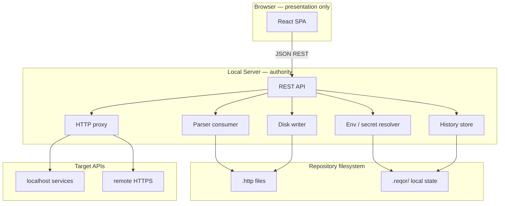
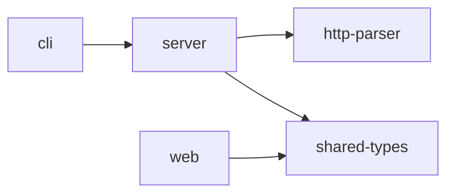
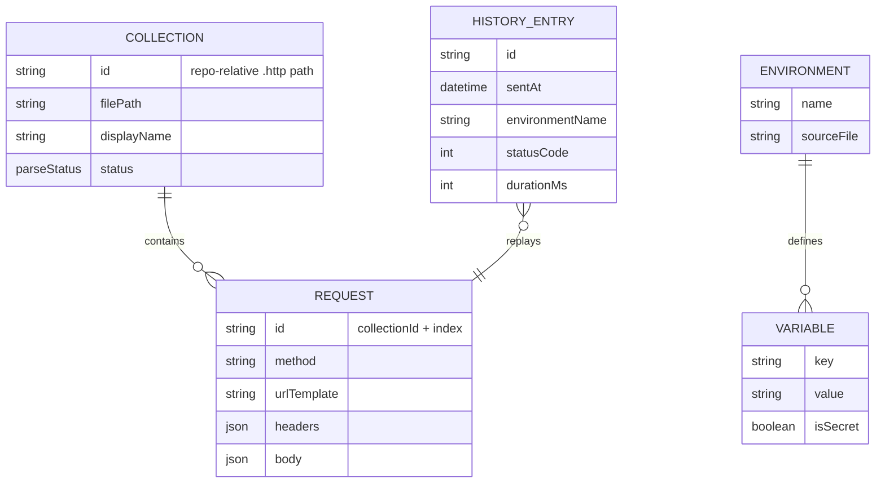

# Architecture Spine — Reqor MVP

## Design Paradigm

**Thin-Client Local BFF.** The browser is presentation only. A single Node.js Local Server is the authority for parsing `.http` files, resolving environments and secrets, proxying HTTP to target APIs, persisting history, and writing disk changes. The Web UI issues commands and renders state; it never calls target URLs and never holds canonical collection data.



## Invariants & Rules

### AD-1 — Monorepo layout and toolchain [ADOPTED]

- **Binds:** all packages
- **Prevents:** version drift, ad-hoc coupling, and incompatible build graphs across cli/server/web/parser
- **Rule:** Use pnpm 11.x workspaces + Turborepo 2.x. Packages live at `packages/cli`, `packages/server`, `packages/web`, `packages/http-parser`, `packages/shared-types`. Internal deps use `workspace:` protocol. Shared dependency versions live in pnpm catalogs. Requires Node.js 22+ (satisfied by AD-15 Node 24 pin).

### AD-2 — Package dependency direction [ADOPTED]

- **Binds:** cli, server, web, http-parser, shared-types
- **Prevents:** circular imports, parser coupled to HTTP framework, web importing server internals
- **Rule:** Allowed edges only: `cli → server`; `server → http-parser, shared-types`; `web → shared-types`. `http-parser` has zero runtime dependency on `server` or `web`.



### AD-3 — Parser owns JetBrains dialect [ADOPTED]

- **Binds:** FR-5, FR-6, FR-7, FR-12, FR-13; http-parser, server
- **Prevents:** duplicate dialect logic in server routes or React components
- **Rule:** `@reqor/http-parser` is the sole owner of JetBrains `.http` parse, AST, and serialize. Server consumes parser output; Web UI receives typed DTOs via API only — no native `.http` parsing in the browser.

### AD-4 — Disk is source of truth [ADOPTED]

- **Binds:** FR-11, FR-12, FR-13; server, web
- **Prevents:** silent disk corruption, lost edits, and UI/server state divergence
- **Rule:** Canonical state lives in `.http` files on disk. UI holds draft state until explicit save. Save uses atomic write (temp file + rename). MVP is edit-only for existing files.

### AD-5 — Minimal-diff disk writes [ADOPTED]

- **Binds:** FR-13, SM-4; http-parser, server
- **Prevents:** noisy Git diffs that break UJ-2 review workflow
- **Rule:** Persist edits by patching the affected Request node in the parser AST and serializing with formatting preservation. On patch failure, fall back to full-file rewrite and surface a warning to the user.

### AD-6 — No browser-origin HTTP to targets [ADOPTED]

- **Binds:** FR-8, FR-9; web, server
- **Prevents:** CORS failures against localhost APIs and split execution paths
- **Rule:** Web UI must not call target URLs. All HTTP execution goes through Local Server proxy using Node native `fetch`.

### AD-7 — Server-side secret handling [ADOPTED]

- **Binds:** FR-9, FR-15, FR-19; server
- **Prevents:** secret leakage via bundle, logs, history, or exported snippets
- **Rule:** Secrets resolve server-side only from repo `.env` file variants (`.env`, `.env.local`, `.env.staging`, etc.) that users already maintain and gitignore. Reqor reads these files; it never writes to them. No separate `.reqor/secrets.env` vault (per SPEC). API responses redact secret values. History, logs, and snippet export never contain plaintext secrets.

### AD-8 — Environment resolution at send time [ADOPTED]

- **Binds:** FR-6, FR-9, FR-14; server
- **Prevents:** client/server variable substitution drift and preview/send mismatch
- **Rule:** Variable and environment resolution runs on the server immediately before proxy execution. Web shows redacted pre-send preview; unresolved variables block send with named errors.

### AD-9 — Single Fastify runtime [ADOPTED]

- **Binds:** FR-1, FR-2, FR-8; server, cli
- **Prevents:** dual HTTP stacks, port conflicts, and divergent middleware
- **Rule:** One Node.js process (started by `reqor serve`) hosts REST API, static Web UI assets, and HTTP proxy via Fastify 5.x plugins. Default port 3000; fail fast on port conflict.

### AD-10 — Typed Web↔Server API contract [ADOPTED]

- **Binds:** all FRs touching UI↔server; server, web, shared-types
- **Prevents:** ad-hoc JSON shapes and incompatible client/server evolution
- **Rule:** REST endpoints use TypeBox schemas defined in `shared-types`. Server validates inbound requests; both packages import the same DTO types. Web uses TanStack Query for server state.

### AD-11 — Collection scan and refresh [ADOPTED]

- **Binds:** FR-3, FR-4; server
- **Prevents:** stale collection lists and inconsistent ignore behavior
- **Rule:** On server start and on manual refresh, recursively scan Repository Root for `*.http` files. Honor `.gitignore` when present; always exclude `node_modules` and `.git`. Parse errors are isolated per file.

### AD-12 — Local state in `.reqor/` [ADOPTED]

- **Binds:** FR-14, FR-16; server
- **Prevents:** polluting Git history and mixing repo content with runtime state
- **Rule:** Runtime-local artifacts live under `.reqor/` at Repository Root: `history.db` and `config.json` only. Secrets are not stored here — they resolve from repo `.env` variants per AD-7. Directory is gitignored; CLI ensures ignore entry on first run.

### AD-13 — History in SQLite [ADOPTED]

- **Binds:** FR-16; server
- **Prevents:** multiple persistence models and unbounded disk growth
- **Rule:** History persists in `.reqor/history.db` via `better-sqlite3`. Cap at 500 entries per Repository Root. Truncate response bodies over 1MB in stored history.

### AD-14 — CLI distribution model [ADOPTED]

- **Binds:** FR-1; cli
- **Prevents:** split install paths and broken `npx` experience
- **Rule:** Publish `@reqor/cli` with `reqor` bin. Package bundles built `server` + `web` dist. Support `npx @reqor/cli serve [path]`.

### AD-15 — Node.js LTS engine pin [ADOPTED]

- **Binds:** all packages
- **Prevents:** runtime incompatibility across contributor machines and CI
- **Rule:** `engines.node` requires `>=24 <25` (Active LTS Krypton). CI and local dev target Node 24.x.

### AD-16 — No outbound telemetry [ADOPTED]

- **Binds:** server; cross-cutting NFRs
- **Prevents:** trust erosion for a local dev tool handling secrets
- **Rule:** Local Server makes no outbound network calls except user-initiated proxied requests. Update check and telemetry are disabled by default in MVP.

### AD-17 — JetBrains MVP dialect scope [ADOPTED]

- **Binds:** FR-5, FR-6, FR-7; http-parser; SM-2
- **Prevents:** parser, server, and fixture suite diverging on IN/OUT constructs
- **Rule:** MVP dialect IN/OUT matrix in `addendum.md` is authoritative until week-4 finalization. Parser fixture suite gates SM-2 (≥90% pass). Constructs marked OUT must return explicit unsupported diagnostics, not silent skip.

### AD-18 — Editor modes and save path [ADOPTED]

- **Binds:** FR-11, FR-12, FR-13; web, server, http-parser
- **Prevents:** client-side `.http` synthesis, dual save formats, and minimal-diff bypass
- **Rule:** Visual editor mutates structured Request DTOs from the server. Raw editor mutates full file text. Mode switch sends current draft to server for re-parse before display update. Save accepts full file `content` only; server runs parse → minimal-diff serialize internally. Web never serializes `.http` text.

### AD-19 — HTTP redirect policy [ADOPTED]

- **Binds:** FR-8; server, web
- **Prevents:** proxy and UI disagreeing on redirect behavior
- **Rule:** Proxy follows redirects by default (max 10 hops). `POST /api/execute` accepts optional `followRedirects: boolean` per request; web exposes toggle defaulting to true.

### AD-20 — Environment and secret ownership [ADOPTED]

- **Binds:** FR-7, FR-9, FR-14, FR-15; http-parser, server
- **Prevents:** parser and server both owning resolution with conflicting precedence
- **Rule:** Parser parses `http-client.env.json` and recognizes `{{$dotenv KEY}}` references. Server `EnvResolver` owns merge order at send time: active environment file → repo `.env` variants (read-only). Reqor never writes to `.env` files. No `.reqor/secrets.env` vault.

### AD-21 — Request identity and rematch [ADOPTED]

- **Binds:** FR-10, FR-16; server, web, shared-types
- **Prevents:** history replay and execute targeting wrong request after re-parse
- **Rule:** API uses `requestIndex` (0-based parse order) for execute/save within a collection. Each Request DTO includes `fingerprint` = hash(method + urlTemplate). On collection reload, web rematches selection and history replay by `collectionId` + `fingerprint`. History entries persist `fingerprint`, not index alone.

### AD-22 — Parser AST to API DTO mapping [ADOPTED]

- **Binds:** AD-3, AD-10; http-parser, server, shared-types
- **Prevents:** parser internal types leaking to web with incompatible shapes
- **Rule:** Parser exports internal AST types consumed only by server. `shared-types` defines API DTOs. Server implements explicit `toDto()` mapper; web imports DTOs only, never parser AST.

### AD-23 — Active environment persistence [ADOPTED]

- **Binds:** FR-14; server, web
- **Prevents:** environment selection lost on restart vs session-only drift
- **Rule:** Active environment name persists in `.reqor/config.json`. Server loads on start; web reads/writes via API.

### AD-24 — History body retention [ADOPTED]

- **Binds:** FR-16; server
- **Prevents:** truncated history with no retrieval path
- **Rule:** History stores full response body on disk; list/detail DTOs truncate display at 1MB. `GET /api/history/:id` returns full body; UI shows truncation marker with expand action.

## Consistency Conventions

| Concern | Convention |
| --- | --- |
| Naming (entities, files, interfaces, events) | Domain terms from PRD glossary (Collection, Request, Environment, History Entry). Package names `@reqor/<name>`. API paths kebab-case plural (`/api/collections`, `/api/history`). TypeScript types PascalCase; files kebab-case. |
| Data & formats (ids, dates, error shapes, envelopes) | Collection id = repo-relative `.http` path (POSIX separators). Request identity = `collectionId` + `requestIndex` + `fingerprint` (see AD-21). Errors: `{ error: { code, message, details? } }`. Timestamps ISO-8601 UTC. |
| State & cross-cutting (mutation, errors, logging, config, auth) | Mutations: disk writes and history inserts server-only. Logging: Pino via Fastify; never log secret values. Config: `.reqor/config.json` for port/UI prefs. No auth in MVP (local-only). |

## Stack

| Name | Version |
| --- | --- |
| Node.js (Active LTS) | 24.x |
| pnpm | 11.x |
| Turborepo | 2.x |
| TypeScript | 5.9.x |
| Fastify | 5.x |
| TypeBox | 0.34.x |
| React | 19.x |
| Vite | 6.x |
| TanStack Query | 5.x |
| better-sqlite3 | 12.x |
| Vitest | 3.x |

## Structural Seed

```text
reqor/
  packages/
    cli/              # reqor bin; starts server; opens browser
    server/           # Fastify app: API, proxy, static, disk, history
    web/              # React SPA (Vite build → server public/)
    http-parser/      # JetBrains dialect AST, parse, serialize
    shared-types/     # TypeBox schemas + DTO types for API contract
  pnpm-workspace.yaml
  turbo.json
  package.json
```



### Deployment & environments

| Environment | Topology | Notes |
| --- | --- | --- |
| Local dev | `pnpm turbo dev` — Vite HMR for web, Fastify watch for server | Web proxies API to localhost:3000 |
| Local prod-like | `reqor serve` — single process serves API + static dist | Matches end-user experience |
| CI | Node 24, `pnpm turbo build test` | No deploy target; npm publish only |

MVP has no hosted/cloud deployment. Reqor Cloud is post-MVP.

## Capability → Architecture Map

| Capability / Area | Lives in | Governed by |
| --- | --- | --- |
| CLI start + browser launch (FR-1) | packages/cli | AD-9, AD-14 |
| Web UI static serve (FR-2) | packages/server | AD-9 |
| `.http` discovery + refresh (FR-3, FR-4) | packages/server | AD-11, AD-3 |
| JetBrains parse (FR-5–FR-7) | packages/http-parser | AD-3 |
| HTTP proxy execution (FR-8) | packages/server | AD-6, AD-9 |
| Env/variable resolution (FR-9, FR-14, FR-15) | packages/server | AD-7, AD-8 |
| Collections UI (FR-10) | packages/web | AD-10 |
| Request editor (FR-11, FR-12) | packages/web + server | AD-4, AD-10 |
| Save to disk (FR-13) | packages/server + http-parser | AD-4, AD-5 |
| History (FR-16) | packages/server | AD-12, AD-13 |
| cURL import/export (FR-17, FR-18) | packages/server + http-parser | AD-3, AD-10 |
| Snippet export (FR-19) | packages/server | AD-7, AD-10 |
| Redirect toggle (FR-8) | packages/server + web | AD-19 |
| Editor sync (FR-11, FR-12) | packages/web + server | AD-18, AD-22 |
| Env/secrets (FR-14, FR-15) | packages/server + http-parser | AD-20, AD-23 |

## Deferred

| Item | Reason |
| --- | --- |
| Postman import converter | Post-MVP fast-follow; no shared data model yet |
| VS Code REST Client dialect | Separate parser surface; JetBrains quality gate first |
| Filesystem watch / live reload | Manual refresh sufficient for MVP (FR-4) |
| Create-new `.http` files from UI | Edit-only reduces scope; fast-follow if time |
| Reqor Cloud / hosted deployment | Validate local adoption first |
| Desktop app (Electron/Tauri) | Web-first validates core workflow |
| OAuth2, pre-request scripts, file inclusion | JetBrains advanced constructs; post-MVP per addendum matrix |
| `@name` request references | Post-MVP |
| Auto-increment port on conflict | Fail-fast chosen for MVP; revisit if UX feedback |
| WCAG 2.1 AA | Basic keyboard nav only for dev-tool MVP |
| Go/Java snippet languages | JS, Python, cURL sufficient for MVP |
| License finalization (MIT vs Apache 2.0) | Legal choice; does not block build |
| npm namespace `@reqor/cli` availability | Verify before publish week 8 |
