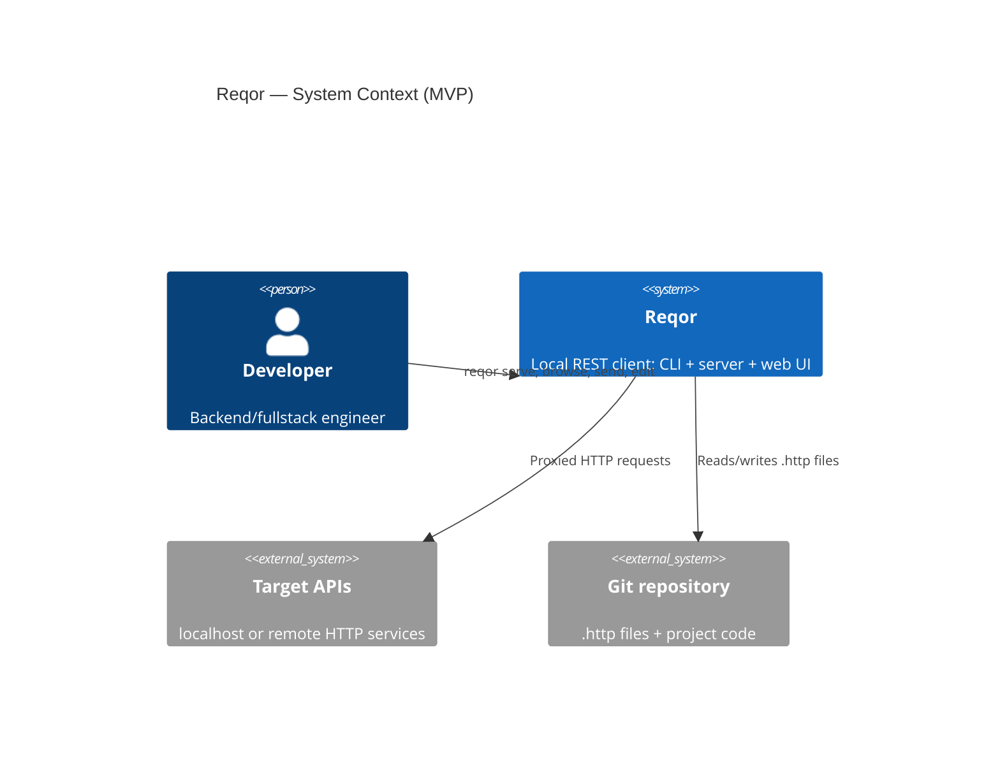
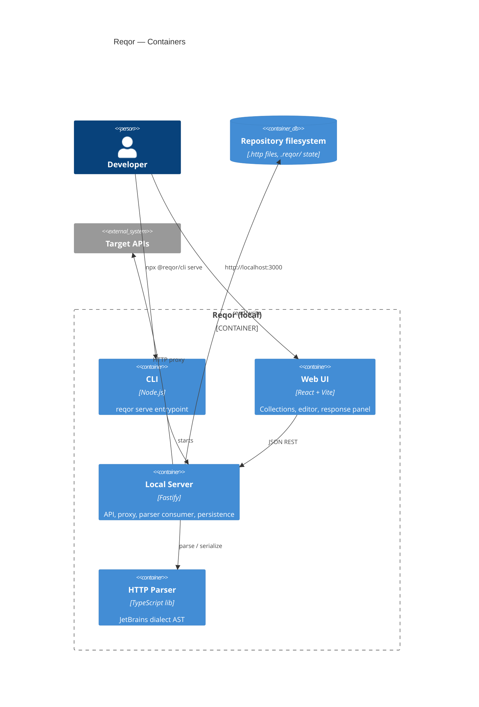
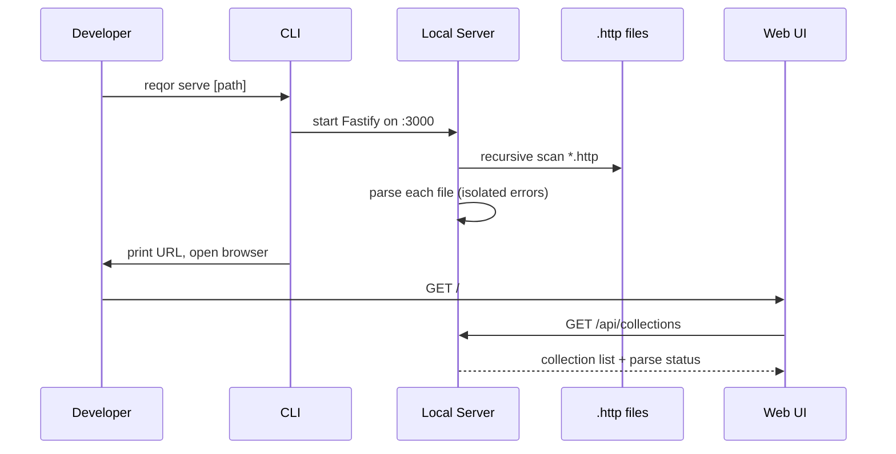
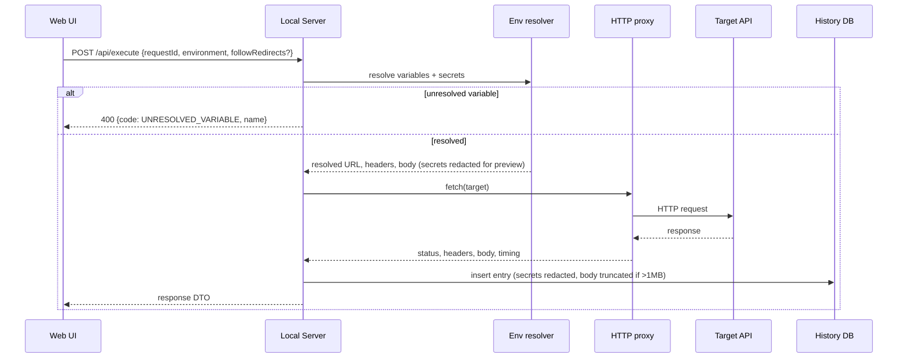
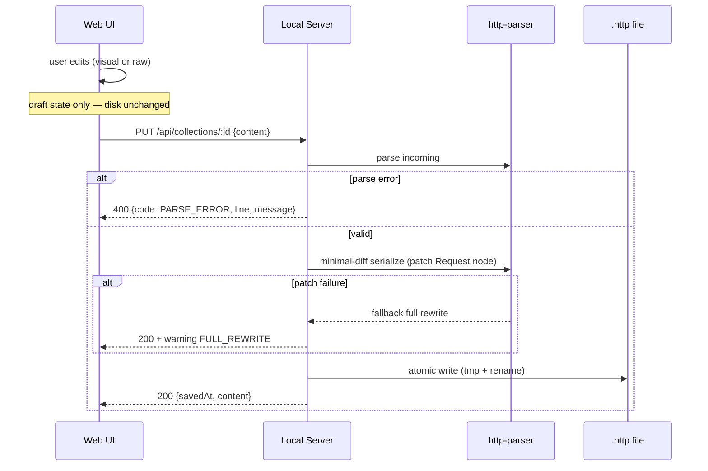

# Reqor MVP — Solution Design

This document explains **how** Reqor is built for developers and solution architects. The terse build contract lives in [ARCHITECTURE-SPINE.md](./ARCHITECTURE-SPINE.md); this doc carries the narrative, flows, and interface detail a builder needs on day one.

---

## 1. Problem and solution shape

Reqor turns JetBrains `.http` files already in a Git repo into a browsable, runnable collection in the browser. The core constraint is **CORS**: browsers cannot reliably call `localhost:8080` from a web UI. Reqor solves this with a **local BFF pattern**:

- **Browser** — React SPA for navigation, editing, and response display
- **Local Server** — Node.js process that parses `.http` files, resolves variables, proxies HTTP, writes disk, and stores history
- **Disk** — `.http` files remain the collaboration artifact; Git is the sync layer

No accounts, no cloud, no proprietary collection format in MVP.

---

## 2. System context



---

## 3. Container view



### Package responsibilities

| Package | Responsibility | Key outputs |
| --- | --- | --- |
| `@reqor/cli` | Parse argv, start server, open browser | `reqor` bin |
| `@reqor/server` | REST API, proxy, scan, env resolver, history, disk writer | Running process on :3000 |
| `@reqor/web` | SPA: sidebar, editor, response viewer, history panel | Static `dist/` |
| `@reqor/http-parser` | JetBrains `.http` parse → AST → serialize | Typed `Collection`, `Request` models |
| `@reqor/shared-types` | TypeBox schemas + DTOs shared by server and web | API contract types |

---

## 4. Runtime flows

### 4.1 Cold start (UJ-1)



**Failure modes:**
- Port in use → exit non-zero with message (fail-fast, no auto-increment)
- Path missing → exit non-zero
- Parse error in one file → that collection shows error badge; others load normally

### 4.2 Send request (UJ-1, UJ-3)



**Security invariant:** secrets never appear in Web responses, logs, history bodies, or exported snippets.

### 4.3 Edit and save (UJ-2)



---

## 5. API surface (MVP)

Base URL: `http://localhost:3000/api`. All schemas live in `@reqor/shared-types`.

| Method | Path | Purpose |
| --- | --- | --- |
| GET | `/collections` | List collections with parse status |
| GET | `/collections/:id` | Collection detail + requests |
| POST | `/collections/refresh` | Re-scan repository |
| PUT | `/collections/:id` | Save full `.http` content to disk (server runs minimal-diff internally) |
| GET | `/environments` | List environments from env files |
| POST | `/execute` | Resolve + proxy a request |
| GET | `/history` | Paginated history list |
| GET | `/history/:id` | History entry detail |
| POST | `/import/curl` | cURL → Request DTO |
| GET | `/export/curl/:requestId` | Request → cURL |
| GET | `/export/snippet/:requestId` | Request → JS/Python/cURL snippet |

Error envelope (all endpoints):

```json
{
  "error": {
    "code": "PARSE_ERROR",
    "message": "Unexpected token at line 14",
    "details": { "line": 14, "file": "http/users.http" }
  }
}
```

---

## 6. Parser architecture

The JetBrains dialect parser is the **critical path** (weeks 1–3). It is isolated in `@reqor/http-parser` so it can be unit-tested against a fixture corpus without spinning up a server.

### AST model (conceptual)

```
CollectionFile
├── metadata (sourcePath)
├── requests[]
│   ├── method, url, httpVersion
│   ├── headers[]
│   ├── body (raw | json | form)
│   └── span (line range for minimal-diff)
├── comments[] (preserved on serialize)
└── diagnostics[] (parse errors)
```

### MVP dialect scope

Per addendum matrix — IN: request line, `###` separator, headers, body, query params, `{{variable}}`, `$uuid`/`$timestamp`/`$randomInt`, `http-client.env.json`, `{{$dotenv KEY}}`. OUT: `@name` refs, pre-request scripts, file inclusion, OAuth2 helpers.

### Test strategy

- Curated fixture set of 50 real-world `.http` files (SM-2: ≥90% parse pass)
- Round-trip tests: parse → serialize → parse produces equivalent AST
- Minimal-diff tests: edit one request → only that block's lines change in output

---

## 7. Local state: `.reqor/`

```
.reqor/
  history.db      # SQLite — last 500 entries
  config.json     # port preference, active environment, UI prefs
```

Created on first run. Added to `.gitignore` automatically. Never committed.

Secrets resolve from repo `.env` variants (`.env`, `.env.local`, `.env.staging`, etc.) — read-only; not stored under `.reqor/` (AD-7, AD-20, SPEC).

---

## 8. Web UI architecture

### Stack

- React 19 + Vite 6 + TypeScript 5.9
- TanStack Query 5 for all server state (collections, history, environments)
- Local UI state (editor drafts, panel layout) in React state or lightweight context — no Redux

### Key screens

| Screen | Data source | Notes |
| --- | --- | --- |
| Collection sidebar | `GET /collections` | Tree by file path; error badge on parse failure |
| Request editor | `GET /collections/:id` | Dual mode: visual form + raw Monaco/CodeMirror |
| Response panel | `POST /execute` result | JSON/XML/plain highlighting |
| Environment picker | `GET /environments` | Toolbar dropdown |
| History drawer | `GET /history` | Click to replay into editor |

### Editor sync model

Visual and raw editors share one draft state governed by AD-18:

1. **Visual mode** — mutates structured Request DTO fields returned by the server
2. **Raw mode** — mutates full file text string
3. **Mode switch** — POST current draft to server for re-parse; server returns updated DTOs or parse errors
4. **Save** — PUT full `content` string; server alone runs minimal-diff serialize

Web never generates `.http` syntax client-side.

### Request identity

Each Request DTO carries `requestIndex` and `fingerprint` (hash of method + urlTemplate). After collection reload, UI rematches by fingerprint so history replay and selection survive re-parse (AD-21).

### Parser ↔ API boundary

Parser AST types stay inside `@reqor/http-parser` and `server`. `@reqor/shared-types` defines API DTOs. Server `toDto()` mapper is the only translation layer (AD-22).

### Environment merge order

At send time, server resolves: active environment file → repo `.env` variants (read-only). Parser recognizes syntax; server owns merge (AD-20). No `.reqor/secrets.env` vault.

### Dev vs prod

| Mode | Web served from | API |
| --- | --- | --- |
| `pnpm turbo dev` | Vite dev server (:5173) with proxy to :3000 | Fastify :3000 |
| `reqor serve` | Fastify `@fastify/static` from `web/dist` | Same origin :3000 |

---

## 9. Build and CI

### Monorepo tasks (Turborepo 2.x)

```json
{
  "tasks": {
    "build": { "dependsOn": ["^build"], "outputs": ["dist/**"] },
    "test": { "dependsOn": ["^build"], "outputs": ["coverage/**"] },
    "dev": { "cache": false, "persistent": true },
    "typecheck": { "outputs": [] }
  }
}
```

### Suggested 8-week build order

| Weeks | Package focus | Exit criteria |
| --- | --- | --- |
| 1–3 | `http-parser` + fixtures | SM-2 ≥90% fixture pass |
| 4 | `server` scan + parse API | FR-3, FR-5 via API tests |
| 5 | `server` proxy + env resolver | FR-8, FR-9, UJ-3 demo |
| 6 | `web` browse + send + response | UJ-1 end-to-end |
| 7 | `web` editor + save + history | UJ-2, FR-16 |
| 8 | `cli` packaging, cURL, snippets, docs | All MVP FRs, README quickstart |

---

## 10. Cross-cutting concerns

### Security

| Concern | Approach |
| --- | --- |
| Secrets | Server-only vault; redacted everywhere else |
| Telemetry | None in MVP |
| Local attack surface | Binds localhost only; no remote access |
| Dependency supply chain | pnpm lockfile; CI audit |

### Performance targets (from PRD NFRs)

- Web UI initial load ≤ 2s on localhost
- Send click → loading state ≤ 100ms
- Collection refresh ≤ 3s for 100 `.http` files

### Reliability

- Single request failure does not crash server process
- Parser errors isolated per file
- Atomic disk writes prevent partial corruption

---

## 11. Architecture decisions index

Full rules with Binds/Prevents: [ARCHITECTURE-SPINE.md](./ARCHITECTURE-SPINE.md).

| AD | Summary |
| --- | --- |
| AD-1 | pnpm + Turborepo monorepo |
| AD-2 | Strict package dependency direction |
| AD-3 | Parser owns JetBrains dialect |
| AD-4 | Disk is source of truth |
| AD-5 | Minimal-diff disk writes |
| AD-6 | No browser-origin HTTP |
| AD-7 | Server-side secrets |
| AD-8 | Env resolution at send time |
| AD-9 | Single Fastify runtime |
| AD-10 | Typed API contract via shared-types |
| AD-11 | Scan + manual refresh |
| AD-12 | `.reqor/` local state |
| AD-13 | SQLite history |
| AD-14 | `@reqor/cli` distribution |
| AD-15 | Node 24 LTS pin |
| AD-16 | No telemetry |
| AD-17 | JetBrains dialect scope from addendum matrix |
| AD-18 | Editor modes; server-only serialize |
| AD-19 | Redirect policy (default follow) |
| AD-20 | Env/secret merge ownership |
| AD-21 | Request fingerprint rematch |
| AD-22 | Parser AST → API DTO mapper |
| AD-23 | Active environment in config.json |
| AD-24 | History full-body retrieval |

---

## 12. Open items (non-blocking for build start)

1. Final JetBrains dialect matrix — target week 4
2. `@reqor/cli` npm namespace availability — verify before publish
3. License: MIT vs Apache 2.0
4. Create-new `.http` files — deferred post-MVP unless time permits

---

## 13. What comes next

1. **bmad-spec** — adopt this spine as a spec companion (stable AD IDs)
2. **bmad-create-epics-and-stories** — decompose into buildable epics aligned to the 8-week phases
3. **Scaffold monorepo** — `pnpm dlx create-turbo@latest` then reshape to `packages/`-only layout per Structural Seed (drop default `apps/` scaffold)
